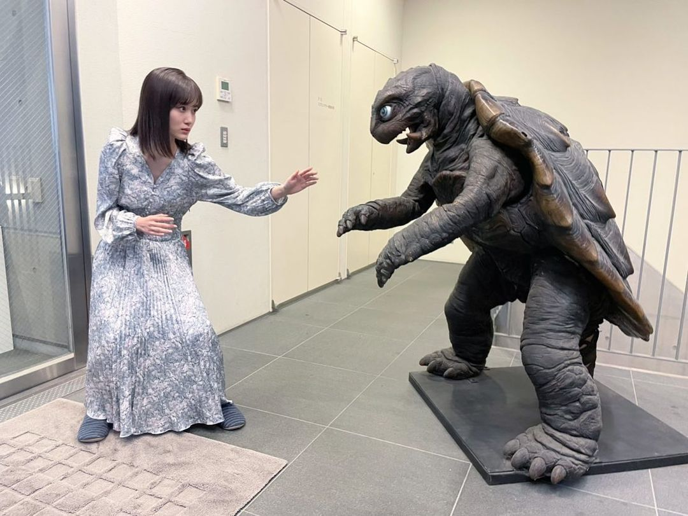

# Zukki vs The Great Devil Turtle Gamera

## Index

1. Concept and Initial Idea
2. Technologies
3. Best Practices
4. What I learned and what could have been improved
5. Results

## 1. Concept and Initial Idea

This is a website made just to have fun and practice a little bit of css animations. The idea came after I first saw the photo of Mizuki Yamashita and the statue of Gamera, I tough it would look really cool if could create something with that.

The concept is about a battle between the two in a pos apocalyptic world, Initially I didn't had a design or something ready for the design of the site, so everything was just being decided in the moment, really a project just for fun.

## 2. Technologies

The technologies used were basically HTML5 and CSS3 with a lot of animations to give the effects in the hero section and in the fight effects. 

- HTML5
- CSS3

## 3. Best practices

For this project I used the css classes naming  pattern **B.E.M** witch consist of Block, Element and Modification. That's a way of give names do classes to not create conflicts between elements and to facilitate the manutention of the code in the future.

I also tried my best to maintain the css code the most small possible using the principles of **DRY**, but since the site was being created without previous planning some things here and there didn't follow the DRY concept and could have been done better.

Besides that, the site is **totally responsive** and made with the concept of **mobile first** which in my opinion is the most efficient way of build a website.

## 4. What I have learned and what could have been done better

This project was awesome to practice what I have been learning, things like animations, github pages that I have never used before, practice BEM, and overall was a great experience making a project like that from start to finish. 

Although it's just a simple site, this project gave me a lot of insights and experience for the next ones that are about to come. Some of things are, the use of some design tool like Figma to at least have a general idea before the start, typography and colors are another thing that I need to get better. And I could have done something more elaborated with carrousels or something like that.

In the next projects I'm gonna try bring new things with the use of Javascript and a better design with proper beforehand planning with Figma.

## 5. Final result

The final results can be seen here: [Zukki vs Gamera](https://ciel-almeida.github.io/zukki-vs-gamera/)
